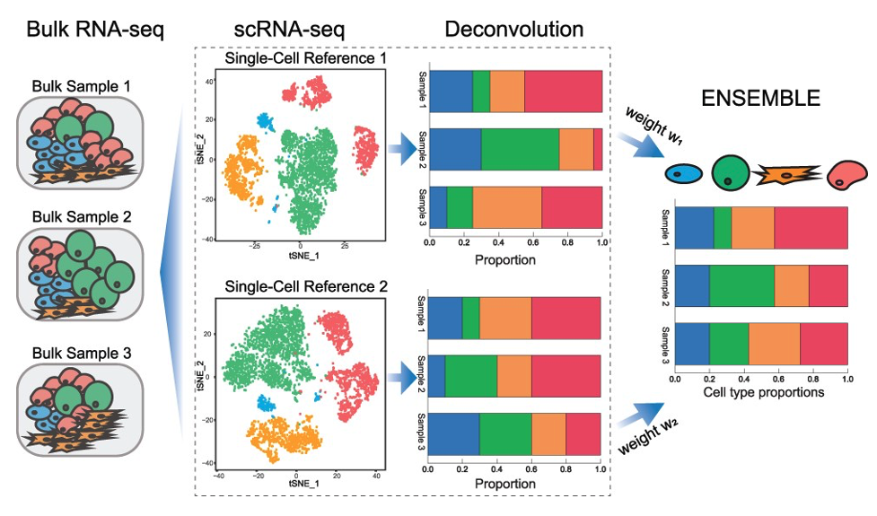

*************************************
Cellular Compositional Profiling
*************************************

Dprofiler provides the Compositional Profiling module for estimating cellular compositions of a submitted bulk expression data set using a reference scRNA expression data.
This guide contains a brief discription of three different Bulk RNA decomposition algorithms (MuSIC, BisqueRNA and SCDC) that Dprofiler incorporates.

MuSiC 
=====

The `MuSIC <https://xuranw.github.io/MuSiC/articles/MuSiC.html>`_ algorithm employs single cell gene expression profiles to acquire non-negative least squares estimates (Wang et al.). A specific feature of MUSIC allows the proportions of closely related cell types to be correctly estimated. To deal with collinearity, MuSiC employs a tree-guided procedure that recursively zooms in on closely related cell types. Rather than pre-selecting marker genes from scRNA-seq based only on mean expression, MuSIC gives weight to each gene allowing for the use of a larger set of genes in deconvolution. The weighting scheme prioritizes consistent genes across subjects: (i) up-weighing genes with low cross-subject variance (informative genes) and (ii) down-weighing genes with high cross-subject variance (non-informative genes). This requirement on cross-subject consistency is critical for transferring cell type-specific gene expression information from one dataset to another.

|

BisqueRNA
=========

The `BisqueRNA <https://rdrr.io/cran/BisqueRNA/f/vignettes/bisque.Rmd>`_ algorithm incorporates single cell gene expression profiles learned from multiple donors/samples to train non-negative least squares regression models (Jew et al.). BisqueRNA employs a unique normalization strategy where the algorithm learns baseline mean and variance expression of each gene from the reference single cell data and uses these estimates to normalize the bulk dataset. This methodology ultimately accounts for technical and experimental biases and allow a much accurate estimation of the cellular fractions across submitted bulk RNAseq samples. Bisque have demonstrated that the decomposition accuracy of Bisque is robust to increasing variation between the generation of the reference profile and bulk expression which is a significant issue, for example when comparing snRNA-seq and bulk RNA-seq data sets.

	
|

SCDC
====

The `SCDC <https://meichendong.github.io/SCDC/index.html>`_ algorithm implements a weighted non-negative least squares regression model with subject-specific maximal variance weights (Dong et al.). SCDC first captures the cross-cell variation for each gene and cell type of every individual. Within-subject variance is calculated using the cross-cell variations which then used to normalize and scale the single cell read counts before RNA deconvolution. 

	
|