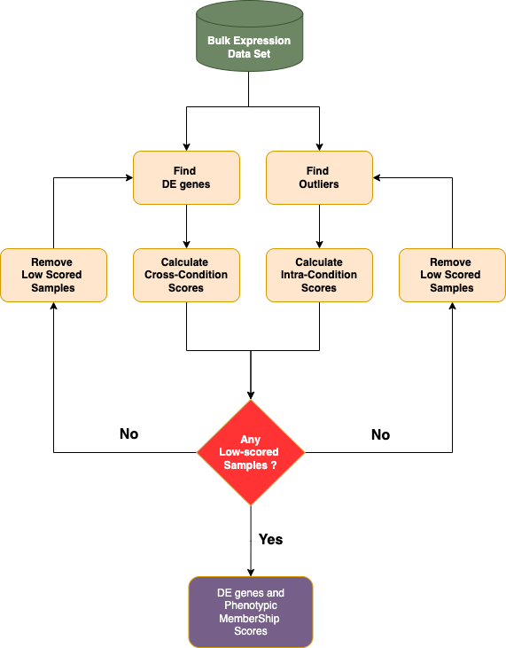

*************************************
Computational Phenotypic Profiling
*************************************

This guide contains a brief description of the Computational Profiling Analysis used within Dprofiler. 

An Iterative Profiling Algorithm
================================

|

Dprofiler provides methods for calculating membership scores to be used for profiling samples associated to phenotypic profiles of interest. By iteratively removing samples with low scores and repeatatively testing for differentially expressed genes, Dprofiler converges if there are no more low-scored samples left in the data set. The final list of samples with high membership scores establish homogeneous (pure) reference profiles of these phenotypic groups, and they are used to calculate the final score to establish the profile of each individual sample. Hence, Dprofiler

* analyzes the cook's distance of all genes within each samples.
* estimates the **intra-condition membership scores** given summarized cook's distances of all genes within each sample.
* conducts a DE analysis (DESeq2, EdgeR or Limma) given remaining samples within the data.
* estimates the **cross-condition membership scores** (based on either Silhouette and NNLS) of all samples given expression profiles limited to differentially expressed genes.
* removes samples with low membership scores.
* repeats until no more samples have to be removed from the data.

Dprofiler provides two distinct types of membership scores that are aimed to interrogate the similarity of a sample to a phenotype. These are: 

* **Intra-condition Membership Score**

This membership score determines if the sample is simply an **outlier** of the phenotype or not; that is, its expression profile shows (or doesnt show) a highly dissimilar pattern given the remaining samples within the same phenotypic condition. This score is calculated using the **Cook's distance**. 

* **Cross-condition Membership Score**

This membership score determines if the sample is either similar to one phenotypic condition compared to the other condition(s). Dprofiler offers two methods to calculate the cross-condition membership score. First of these measures is the **Silhouette index** that allows quality control of partitioning algorithms once datasets are clustered into meaningful subsets of samples. However, we utilize the silhouette index to detect those samples that do not well clustered or classified into their associated groups or conditions. The second method is based on a linear regression method whose coefficients are regularized to non-negative values as to calculate the percentage of input variables. Such a method allows us to model expression profile of each submitted sample given mean expression profiles of phenotypes/conditions where coefficient are associated to scores, representing the similarity between the condition and the submitted sample. 

Cook's Distance
===============

`Cook's distance <https://en.wikipedia.org/wiki/Cook%27s_distance)>`_ of a sample is simply provided by calculating the difference between estimated mean and dispersion parameters of each gene when the sample is removed from the analysis. The distance is the difference between two estimation of the underlying negative binomial parameters of the gene. We incorporate :math:`\alpha`'th quantile of the distribution of cook's distances of all genes (typically :math:`\alpha=75`). We calculate the intra-condition membership score as :math:`1-F(X,2,m-2)` where X being the :math:`\alpha`'th quantile of the distribution of cook's distances, :math:`F(X, d_{1}, d_{2})` is the cumulative distribution function of X being a random variate of F-distribution with degrees of freedom :math:`d_{1}` and :math:`d_{2}`. Here, :math:`m` is the number of samples in the condition. 

Silhouette Measure
==================

`Silhouette measure <https://en.wikipedia.org/wiki/Silhouette_(clustering)>`_ of a sample is calculated given a known partitioning (or classification) of data set and a measure of distance between all samples within the data set. We use Spearman correlation as a distance measure between expression profiles of each sample since it has been shown to be quite robust in many biological data analysis platforms and software tools (citation). The silhouette measure of each sample is calculated by separately measuring the average distance to all samples with the label and the minimum of all averages distances to other clusters with different labels, then these two measures are subtracted and normalized to calculate an index universally between -1 and 1. A silhouette measure of -1 would indicate that the sample is misclustered to its associated group and it is highly likely that its expression profile is more similar to samples of other conditions/groups. A silhouette measure of 1 would indicate a perfect clustering of the sample, and silhouette measure 0 would indicate an ambiguous similarity of expression profiles between at least two conditions. We normalize silhouette measure of each submitted sample between (0,1) to establish the membership score.  

Non-negative Least Squares
==========================

The second type of membership score available to Dprofiler users is `non-negative least squares <https://en.wikipedia.org/wiki/Non-negative_least_squares>`_ (NNLS) regression-based score where the non-negative beta coefficients are provided by the lawson-hanson implementation of NNLS regression. Such regression analysis has been applied to various problems where target profiles were confounded by a mixture of baseline profiles and hence target profiles are detected to exhibit heterogeneous properties. Applications include proteomics, genomics, imaging and economics. We use NNLS to detect the heterogeneous samples whose expression profiles are abundant in sets of biomarkers of multiple conditions within the disease study, hence deemed as heterogeneous. We use the mean expression profiles of all the conditions as an input to the non-negative regression problem where the response variable is the sample we would like to detect its degree of heterogeneity. We use the estimated coefficients are the membership scores. 
