*****************
Quick-start Guide
*****************

This guide is walkthrough for the Dprofiler from start to finish.

Getting Started
===============

First off, we need to install R package of Dprofiler from GitHub::

    if (!requireNamespace("remotes", quietly=TRUE))    
      install.packages("remotes")
    remotes::install_github("UMMS-Biocore/dprofiler")

One you have installed the R package, you can call these R commands::

	library(dprofiler)
	startDprofiler()

Once you've made your way to the website, or you have a local instance of Dprofiler running, you will be greeted with data loading section:

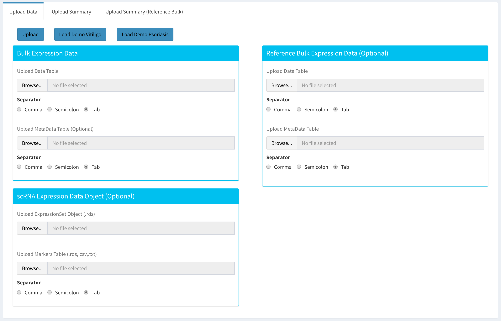

To begin the analysis, you need to upload your data files (comma or semicolon separated, i.e. ".csv", or tab separated, i.e. ".tsv", format) to be analyzed and choose appropriate separator for the file (comma, semicolon or tab).

There are three types input data in Dprofiler. These are:

* **Bulk Expression Data**: used for profiling samples within and establish homogeneous reference profiles. The user should provide a count data but uploading a metadata is optional.
* **scRNA Expression Data Object**: used for deconvoluting Bulk RNA data and infering cellular compositions of these bulk samples. Both single cell count data and the marker table are optional. 
* **Reference Bulk Expression Data**: used for comparative profiling of the Bulk data set using reference phenotypic profiles of reference bulk data set(s). Both reference count data and the metadata are optional.

If you do not have a dataset to upload, you can use the built in Psoriasis demo data file by clicking on the 'Load Demo Psoriasis' button that loads a case study. To view the entire demo data file, you can download.

* `GSE107871 <https://www.ncbi.nlm.nih.gov/geo/query/acc.cgi?acc=GSE107871>`_: a bulk RNA-Seq count data of lesional and non-lesional psoriasis skin samples as well as healthy control samples processed by the RNA-Seq pipeline of DolphinNext.
* `E-MTAB-8142 <https://www.ebi.ac.uk/arrayexpress/experiments/E-MTAB-8142/>`_: a reference scRNA-Seq count data of lesional and non-lesional Psoriasis skin samples.
* `Human Skin RNA Atlas <https://dmeta.dolphinnext.com/>`_: an external reference dataset of integrated bulk RNA-Seq data from multiple Psoriasis studies across four conditions: healthy, lesional, non-lesional.

Otherwise, you can start uploading your own data given instructions below.

Input for Bulk Expression Data
==============================

For both submitted Bulk and Reference Bulk expression data, you need to upload your data files (comma or semicolon separated, i.e. ".csv", or tab separated, i.e. ".tsv", format) to be analyzed and choose appropriate separator for the file (comma, semicolon or tab).

An example structure of the count data files are shown below:

========  ======  ======  ======  ======  ======  ======  ======  ======  ======  ====== 
gene      P1_NL   P1_L    P2_NL   P2_L    P3_NL   P3_L    P4_NL   P4_L    P5_NL   P5_L
========  ======  ======  ======  ======  ======  ======  ======  ======  ======  ======
A1BG      46      29      104     27      42      17      65      101     27      32
A1BG-AS1  27      18      48      13      10      3       39      54      23      24
A1CF      5       0       38      15      2       0       4       7       0       3
========  ======  ======  ======  ======  ======  ======  ======  ======  ======  ======

In addition to the count data file; you might need to upload metadata files to correct for batch effects or any other normalizing conditions you might want to address that might be within your results. To handle for these conditions, simply create a metadata file by using the example table at below. Metadata file also simplifies condition selection for complex data. The columns you define in this file can be selected in condition selection page. Make sure you have defined two conditions per column. If there are more than two conditions in a column, those can be defined empty. Please note that, if your data is not complex, metadata file is optional, you don't need to upload. Hence only for submitted bulk expression data, a count data is mandatory. However for reference bulk expression data, both count data and metadata are optional.

In the example below, the "patient" column may serve as a batch or a normalizing condition.  

============  =======  =========
sample        patient  treatment
============  =======  =========
P1_NL         P1       NL
P1_L          P1       L
P2_NL         P2       NL
P2_L          P2       L
P3_NL         P3       NL
P3_L          P3       L
P4_NL         P4       NL
P4_L          P4       L
P5_NL         P5       NL
P5_L          P5       L      
============  =======  =========

Metadata file can be formatted with comma, semicolon or tab separators similar to count data files. These files used to establish different batch effects for multiple conditions. You can have as many conditions as you may require, as long as all of the samples are present. 

Input for scRNA Expression Data
===============================

For scRNA data set, the user should provide an .rds file containing an `ExpressionSet <https://www.bioconductor.org/packages/devel/bioc/vignettes/Biobase/inst/doc/ExpressionSetIntroduction.pdf>`_ object whose metadata (pData(`You Expression Set Object`)) should include the following variables or columns:

* **(i)** sample/donor associated to each barcode 
* **(ii)** total UMI counts of each barcode  
* **(iii)** (multiple) cell annotation or label of each barcodes 
* **(iv)** other categorical and numerical variables relavant to barcodes

In addition, users should provide a marker table associated with the scRNA ExpressionSet object. Typically, the marker table should include the following columns: 

* **gene:** a column with gene names
* **cluster** a column with cluster names
* **Level** a column that points to the metadata column in scRNA ExpressionSet object including the cluster names.

Users can employ the **getReferenceSingleCellRNA** function in Dprofiler to generate all files necessary for Compositional Profiling. The input should be a Seurat Object.

Upload Summary
==============

Once the count data and metadata files have been loaded in Dprofiler, you can click upload button to visualize your data as shown below:

.. image:: ../dprofiler_pics2/upload_summary.png
	:align: center

|
You have the option to search samples or other terms within submitted bulk Expression data set, and you also have the option to visualize the t-SNE and other numeric measures of your barcodes within the uploaded scRNA expression data object. You can also search and browse samples within the reference bulk Expression data set. 

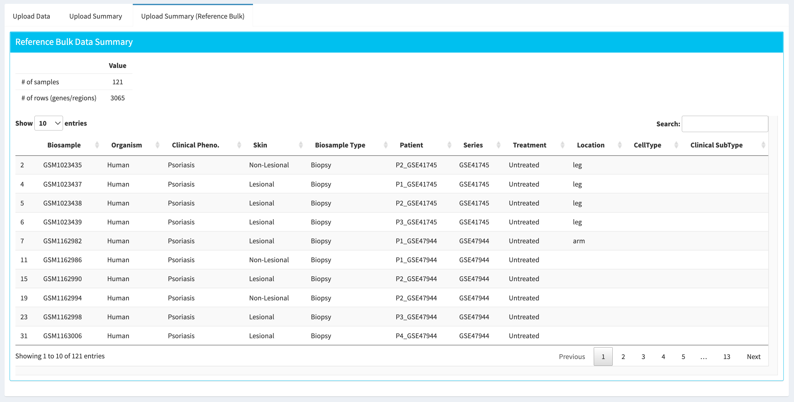

|
After reviewing your uploaded data in "Upload Summary" panels, and if specified the metadata file containing your batch correction fields, you then have the option to filter low counts and conduct batch effect correction prior to your analysis. Alternatively, you may skip these steps and directly continue with Computational Phenotypic Profiling analysis. 

Data analysis steps such as "Low Count Filtering", "Batch Effect Correction", "Computational Phenotypic Profiling" are only applicable to the submitted bulk expression data, and other submitted reference scRNA and bulk RNA datasets are used for referential purposes and assumed to be already filtered and analyzed before submission.

Low Count Filtering
===================

In this section, you can simultaneously visualize the changes of your submitted bulk RNA expression data while filtering out the low count genes. Choose your filtration criteria from **Filtering Methods** box which is located just center of the screen. Three methods are available to be used:

* **Max:** Filters out genes where maximum count for each gene across all samples are less than defined threshold. 
* **Mean:** Filters out genes where mean count for each gene are less than defined threshold. 
* **CPM:**	First, counts per million (CPM) is calculated as the raw counts divided by the library sizes and multiplied by one million. Then it filters out genes where at least defined number of samples is less than defined CPM threshold.

After selection of filtering methods and entering threshold value, you can proceed by clicking **Filter** button which is located just bottom part of the **Filtering Methods** box. On the right part of the screen, your filtered dataset will be visualized for comparison as shown at figure below. 

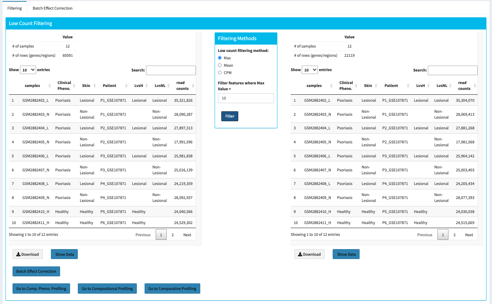
	
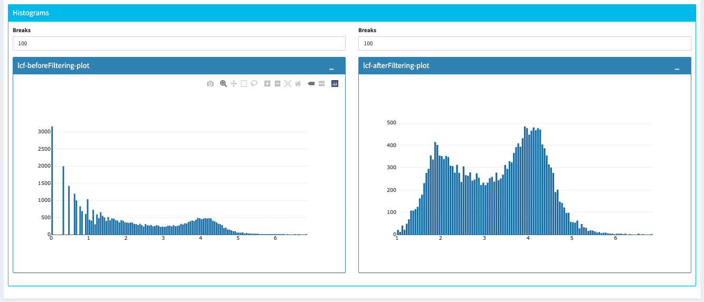

You can easily compare following features, before and after filtering: 

* Number of genes/regions.
* Read counts for each sample.
* Overall histogram of the dataset.
* gene/region vs samples data 

.. important::

	To investigate the gene/region vs samples data in detail as shown at below, you may click the **Show Data** button, located bottom part of the data tables. Alternatively, you may download all filtered data by clicking **Download** button which located next to **Show Data** button.  

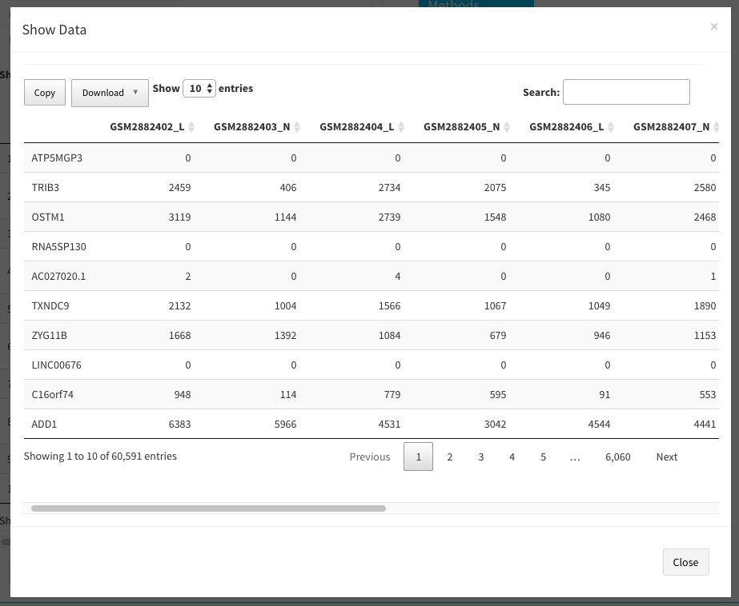

Afterwards, you may continue your analysis with **Batch Effect Correction** or directly move to three different kind of analysis by clicking: 

* Go to Computational Phenotypic Profiling
* Go to Compositional Profiling
* Go to Comparative Profiling

Batch Effect Correction and Normalization
=========================================
If specified metadata file containing your batch correction fields, then you have the option to conduct batch effect correction prior to your analysis. By adjusting parameters of **Options** box, you can investigate your character of your dataset. These parameters of the options box are explained as following:

* **Normalization Method:** Dprofiler allows performing normalization prior the batch effect correction. You may choose your normalization method (among MRN (Median Ratio Normalization), TMM (Trimmed Mean of M-values), RLE (Relative Log Expression) and upperquartile), or skip this step by choosing **none** for this item. 
* **Correction Method:** Dprofiler uses `ComBat <https://bioconductor.org/packages/release/bioc/vignettes/sva/inst/doc/sva.pdf>`_ (part of the SVA bioconductor package) or `Harman <https://www.bioconductor.org/packages/3.7/bioc/vignettes/Harman/inst/doc/IntroductionToHarman.html>`_ to adjust for possible batch effect or conditional biases. 
* **Treatment:** Please select the column that is specified in metadata file for phenotypic comparisons, such as cancer vs control.
* **Batch:** Please select the column name in metadata file which differentiate the batches. 
	
Upon clicking submit button, comparison tables and plots will be created on the right part of the screen as shown below.

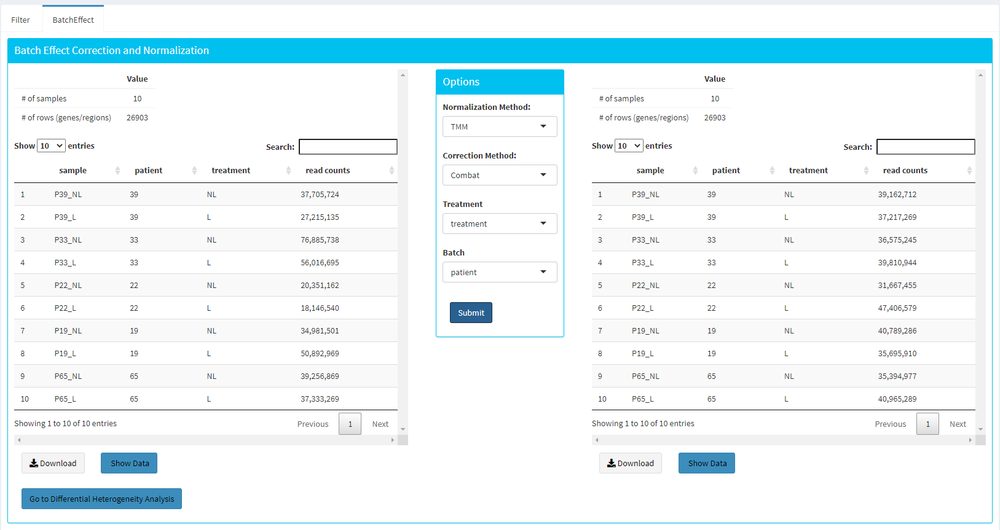
	
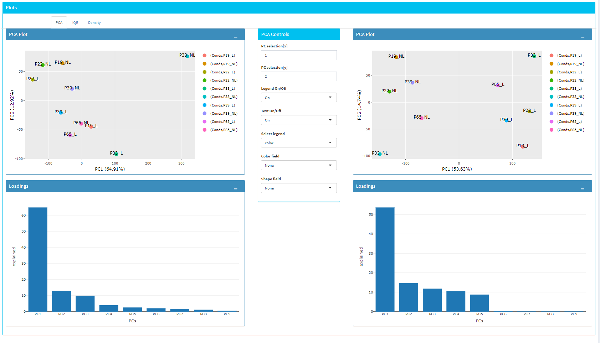

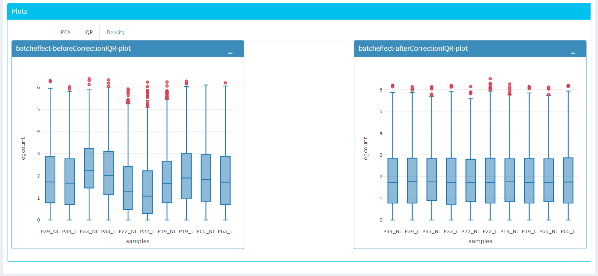

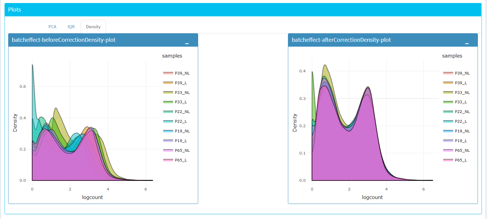

You can investigate the changes on the data by comparing following features:

* Read counts for each sample.
* PCA, IQR and Density plot of the dataset.
* Gene/region vs samples data

.. tip::

  You can investigate the gene/region vs samples data in detail by clicking the **Show Data** button, or download all corrected data by clicking **Download** button.

Since we have completed **batch effect correction and normalization** step, we can continue with either one of three kind of analysis by clicking:

* Go to Computational Phenotypic Profiling
* Go to Compositional Profiling
* Go to Comparative Profiling

Computational Phenotypic Profiling
=======================

The first option, 'Go to Computational Phenotypic Profiling', takes you to the next step where an iterative differential expression analysis and scoring of samples takes place.

* **Sample Selection:** In order to run the analysis, you first need to select the initial set of samples which will be compared or may be removed throughout the analysis. To do so, choose **Select Meta** box as **treatment** to simplify fill ``Condition 1`` and ``Condition 2`` based on the **treatment** column of the metadata as shown below.

        .. image:: ../dprofiler_pics2/score_condition_selection.png
	       :align: center

If you need to remove samples from a condition, simply select the sample you wish to remove and hit the delete/backspace key. In case, you need to add a sample to a condition you can click on one of the condition text boxes to bring up a list of samples and then click on the sample you wish to add from the list and it will be added to the textbox for that comparison.

    .. tip::

**Scoring Parameters:** Two scoring methods are available for Dprofiler: Silhouette and NNLS-based.
  
  * Silhouette method incorporates Spearman correlation measures between samples of the same phenotypic condition to estimate the magnitude of similarity between a particular sample and all other samples in the same group.
  
  * NNLS-based method fits a non-negative regression model with a sample being the response and condition-specific (mean) expression profiles of conditions are input variables.
    
Both methods produce scores between (0,1) where lower values are associated with low membership score indicating that the sample is dissimilar to other samples in the same group/phenotype/condition. You can determine a threshold for low membership scores from the **Min. Score** option which is between (0,1). You can also determine additional criteria for selecting differentially expressed genes by **DE Selection Method** where additional options are provided to choose thresholds for parameters such as **log2FC** and **P-adj value**.  
    
**DE Parameters:** Thera are three DE methods that are available for Dprofiler: DESeq2, EdgeR, and Limma. DESeq2 and EdgeR are designed to normalize count data from high-throughput sequencing assays such as RNA-Seq. On the other hand, Limma is a package to analyse of normalized or transformed data from microarray or RNA-Seq assays. Upon selecting any of three DE analysis methods, additional options will appear for
parameters specific to the selected DE method. 

After clicking on the 'start' button, Dprofiler will analyze your selected comparison and conditions, and store the results into separate data tables. Upon finishing the Computational Profiling, three separate results panels will be produced:

* Profiling Results 
* Impure (Heterogeneous) Conditions
* Pure (Homogeneous) Conditions

Upon finishing the Computational Profiling, the application will switch to "Profiling Results" panel showing results of the analysis. Differentially expressed genes of initial DE analysis and Final DE analysis are compared: that is the number of DE genes at the analysis at
the first and last iteration are compared. The app also informs you about the parameters of the Scoring and DE analysis. 

.. image:: ../dprofiler_pics2/detection.png
	:align: center
	
|
Additional information of initial and final DE genes can be found on plots below. Three **Scatter Plots** of initial and final genes, as well as the common genes in both list of DE genes will be plotted. You can switch to **Volcano Plot** and **MA Plot** by using **Plot Type** section at the left side of the *Discover** menu. Since these plots are interactive, you can click to **zoom** button on the top of the graph and select the area you would like to zoom in by drawing a rectangle. Please see the plots at below:

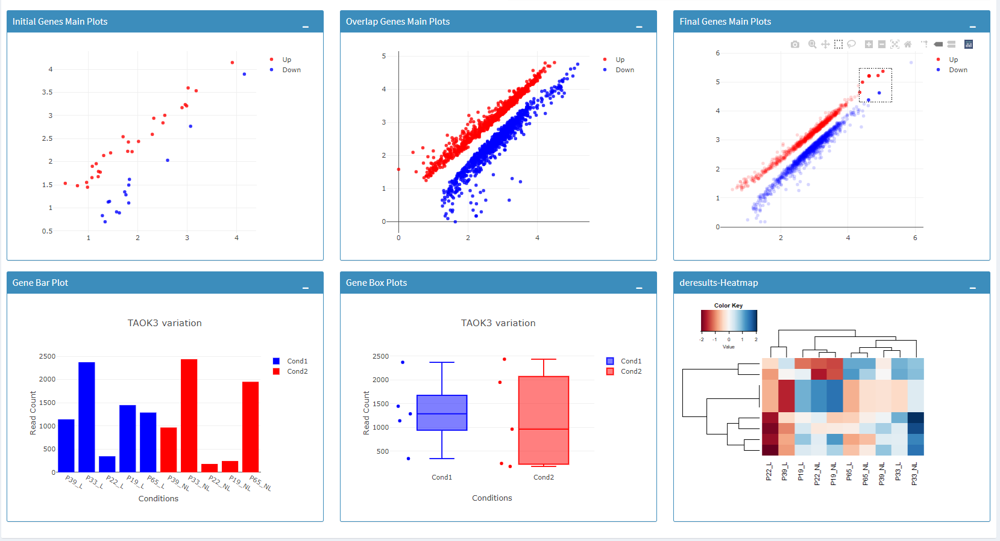
  
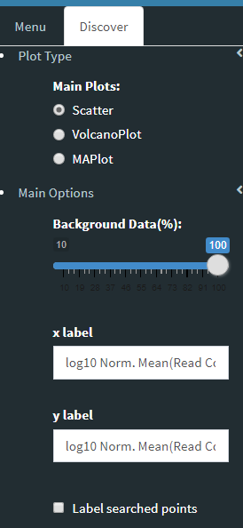
	
You can hover over the scatterplot points to display more information about the point selected. A few bargraphs will be generated for the user to view as soon as a scatterplot point is hovered over.
  
.. tip::

    Please keep in mind that to increase the performance of the generating graph, by default 10% of non-significant(NS) genes are used to generate plots. You might show all NS genes by please click **Main Options** button and change Background Data(%) to 100% on the left sidebar.

.. image:: ../dprofiler_pics2/example_background_data.png
    :align: center
    :width: 30%
    
|
Next, you can initiate a Cellular composition analysis using either the Homogeneouos,  Heterogeneous conditions or marker genes, and deconvolute the Reference bulk expression data using the reference scRNA expression data by clicking "Go to Cellular Composition Analysis". Or, you can click to "Go to Comparative Profiling" for the comparative analysis between the submitted bulk RNA expression and reference bulk RNA data. 

But before that, you can take a look and investigate DE genes of either initial or Final DE analysis from remaining panels. 

Impure and Pure Conditions 
==========================

There are two more panels on the right of Profiling Results panel which take a closer look at
initial and final DE genes of the conditions. 

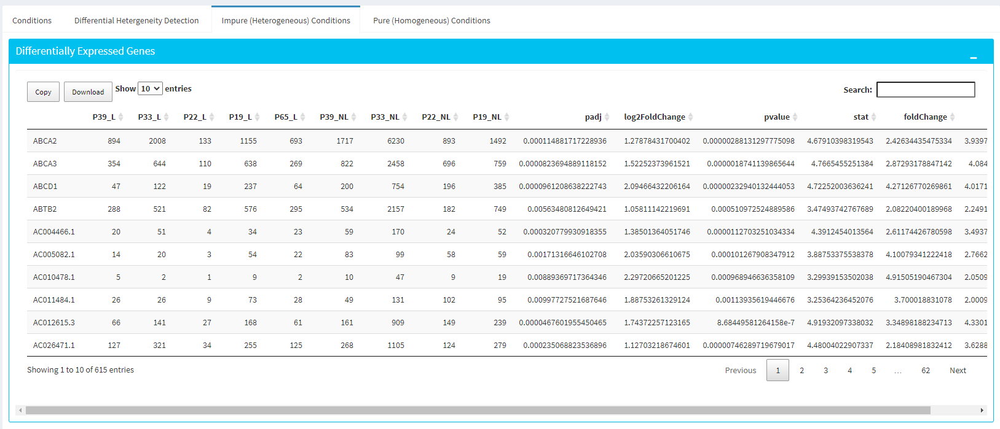

You can always download these results in CSV format by clicking the **Download** button. You can also download the plot or graphs by clicking on the **download** button at top of each plot or graph.

Cellular Composition Profiling 
==============================

By using the "Cellular Composition Profiling" tab, you can determine which of the metadata fields or annotations identifications are to be used to deconvolute the submitted bulk expression data. You can also choose which of those cell types within each ident are to be used for the deconvolution as well. Then you can also decide whether all genes or a selected number of top marker genes will be used for the deconvolution. You should decide which column in the scRNA metadata that the samples are introduced, this is required by all three methods (MuSIC, BisqueRNA and SCDC) to either give weight to genes or normalize the bulk data set. Additional set of features of marker genes such as logFC or adjusted p-value thresholds as well as the percentage of non-zero counts for each marker genes can be specified by the user. 

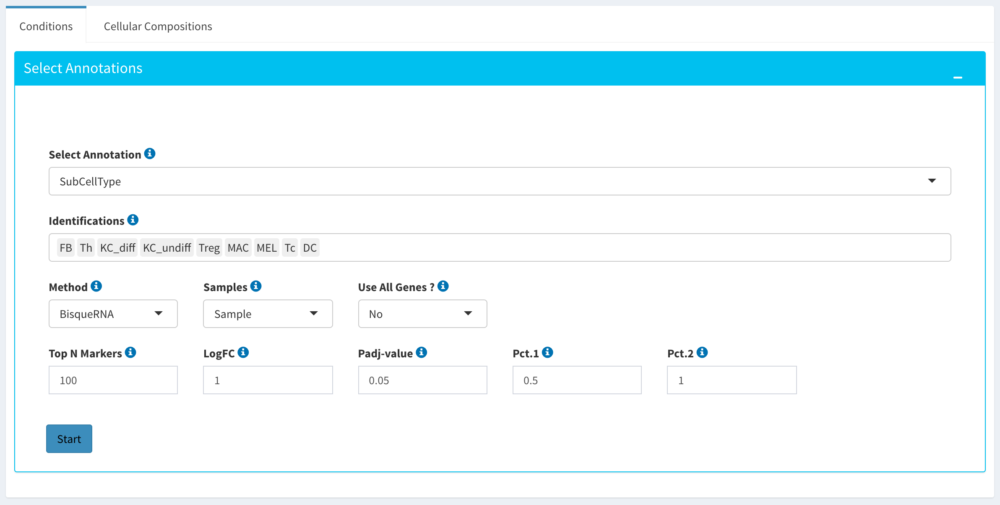

|
After clicking the "Start" button, the results will be given in the "Cellular Compositions" panel. Membership Scores and estimated cell type fractions are given for each sample where each box of the table are highlighted with respect to cell type. 

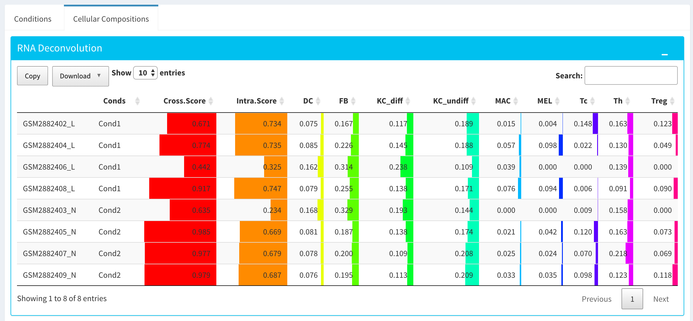
	
|
You can also visualize the count data of submitted bulk expression data set with respect to cellular markers using interactive heatmaps. 

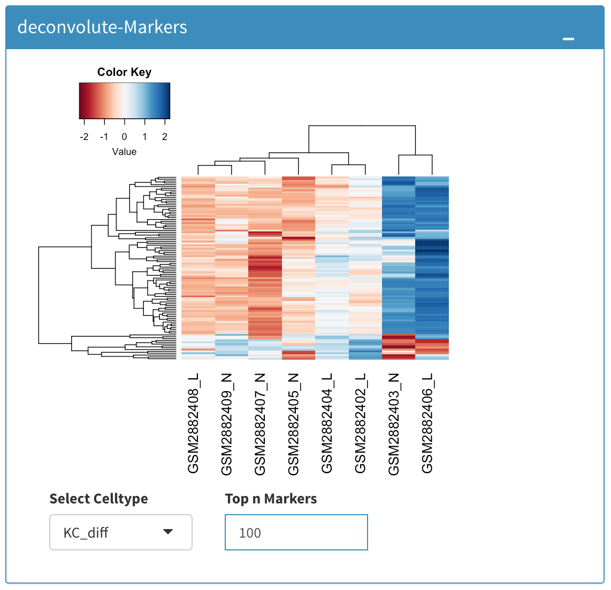
	
|
Comparative Phenotypic Profiling 
================================

By using the "Comparative Phenotypic Profiling" tab, you can to choose which metadata variables to use as a reference to compare samples and conditions
across submitted and reference bulk rna expression datasets. You can select a subset of the data with **Select Series** option, select a metadata variable with **Select Meta** option, and choose membership scoring method by **Score Method** similar to in Computational profiling.

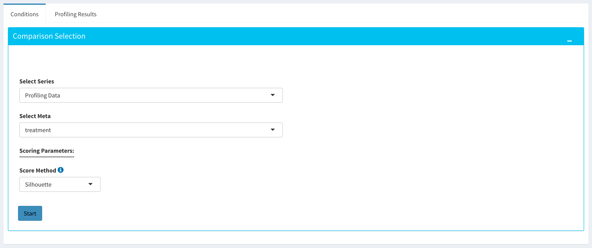
	
|

Once you click **Start** button, Dprofiler calculates the membership scores given conditions/phenotypes in the reference bulk RNA expression data, and visualizes the scores as below. 

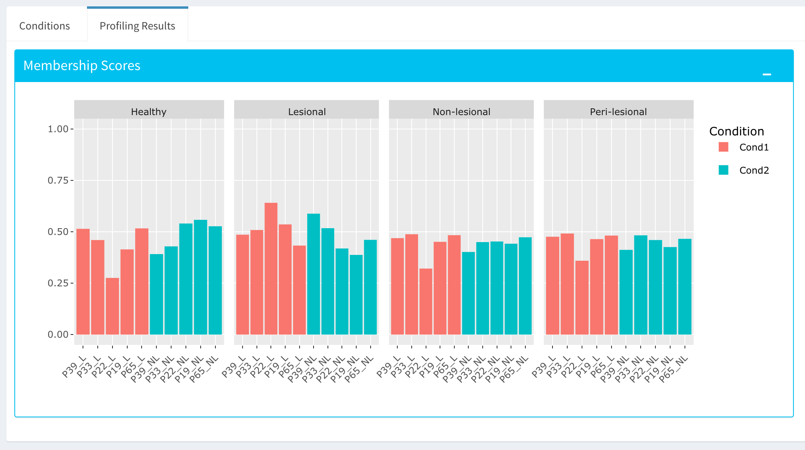

